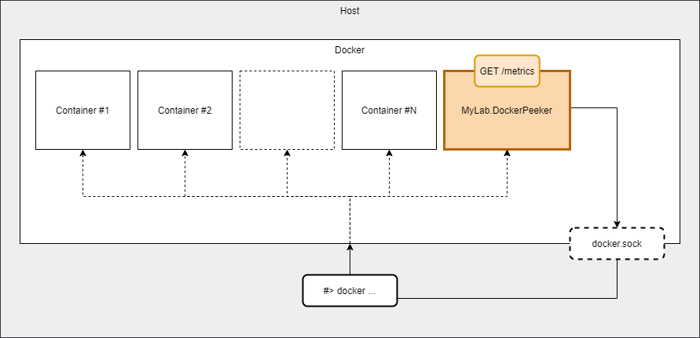

# MyLab.DockerPeeker
[](https://hub.docker.com/r/mylabtools/docker-peeker)

Ознакомьтесь с последними изменениями в [журнале изменений](/changelog.md).

## Обзор

`MyLab.DockerPeeker` - сервис, предоставляющий по запросу метрики docker-контейнеров, развёрнутых на текущей хостовой машине.




Сервис предоставляет метрики в формате [Prometheus](https://prometheus.io/docs/concepts/data_model/):

```
GET http://container_name:80/metrics
```

## Производительность

`MyLab.DockerPeeker` является частичной альтернативой сервиса [cAdvisor](https://github.com/google/cadvisor), поэтому в данном разделе сравнение происходит с ним.

Тестовое окружение:

* RAM: **8 Gb**
* CPU: **2х Intel(R) Xeon(R) CPU E5-2630 v4 @ 2.20GHz**
* Контейнеров: **75**

| Решение            | Потребление памяти | Потребление процессора |
| ------------------ | ------------------ | ---------------------- |
| MyLab.DockerPeeker | 95...119 Mb        | до 4%                  |
| cAdvisor           | 238 Mb             | 24%                    |

## Развёртывание

Сервис развёртывается в docker-контейнере на хостовой машине, где необходимо собирать метрики о контейнерах.

Для корректной работы, необходимо в контейнер сервиса подключить файл сокета докера хостовой машины.

Пример `docker-comopose` файла:

```yaml
version: '3.2'

services:
  docker-peeker:
    image: mylabtools/docker-peeker
    container_name: docker-peeker
    volumes:
    - /var/run/docker.sock:/var/run/docker.sock
```

## Метрики

### Метрики контейнеров

По каждому контейнеру собираются следующие метрики:

| Имя                                             | Тип   | Описание                                                     |
| ----------------------------------------------- | ----- | ------------------------------------------------------------ |
| `container_host_cpu_usage_percentages_total`    | gauge | The percentage of the host’s CPU the container is using      |
| `container_host_memory_usage_percentages_total` | gauge | The percentage of the host’s memory the container is using   |
| `container_memory_usage_bytes_total`            | gauge | The total memory the container is using                      |
| `container_memory_limit_bytes_total`            | gauge | The total amount of memory it is allowed to use              |
| `container_block_input_bytes_total`             | gauge | The amount of data the container has read from block devices on the host |
| `container_block_output_bytes_total`            | gauge | The amount of data the container has written to block devices on the host |
| `container_network_input_bytes_total`           | gauge | The amount of data the container received over its network interface |
| `container_network_output_bytes_total`          | gauge | The amount of data the container has sent over its network interface |

Каждая метрика снабжается следующими меткой имени контейнера`name`.

### Метки контейнеров

Метрики контейнеров снабжаются метками, соответствующими меткам контейнеров. 

Имена меток подвергаются следующим изменениям:

* символы, которые не определяются, как буквы или цифры, заменяются на символ `_`;

* к именам добавляется префикс `container_label_`.

Значения меток подвергаются следующим изменениям:

*  Символы `,` и `"` заменяются на `_`.

