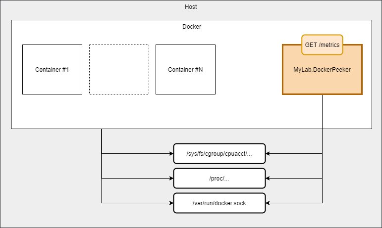

# MyLab.DockerPeeker
[](https://hub.docker.com/r/mylabtools/docker-peeker)

Ознакомьтесь с последними изменениями в [журнале изменений](/changelog.md).

## Обзор

`MyLab.DockerPeeker` - сервис, предоставляющий по запросу метрики docker-контейнеров, развёрнутых на текущей хостовой машине.




Сервис предоставляет метрики в формате [Prometheus](https://prometheus.io/docs/concepts/data_model/):

```
GET http://container_name:80/metrics
```

## Производительность

`MyLab.DockerPeeker` является частичной альтернативой сервиса [cAdvisor](https://github.com/google/cadvisor), поэтому в данном разделе сравнение происходит с ним.

Тестовое окружение:

* RAM: **8 Gb**
* CPU: **2х Intel(R) Xeon(R) CPU E5-2630 v4 @ 2.20GHz**
* Контейнеров: **75**

| Решение            | Потребление памяти | Потребление процессора |
| ------------------ | ------------------ | ---------------------- |
| MyLab.DockerPeeker | 150 Mb             | 0.75%                  |
| cAdvisor           | 238 Mb             | 24%                    |

## Развёртывание

Сервис развёртывается в docker-контейнере на хостовой машине, где необходимо собирать метрики о контейнерах.

Для корректной работы, необходимо в контейнер сервиса подключить:

* файл сокета докера в `/var/run/docker.sock`
* директорию с псевдофайлами контрольных групп в `/etc/docker-peeker/cgroup`
* директорию с псевдофайлами процессов в `/etc/docker-peeker/proc`

Пример `docker-comopose` файла:

```yaml
version: '3.2'

services:
  docker-peeker:
    image: mylabtools/docker-peeker
    container_name: docker-peeker
    volumes:
    - /var/run/docker.sock:/var/run/docker.sock:ro
    - /sys/fs/cgroup:/etc/docker-peeker/cgroup:ro
    - /proc:/etc/docker-peeker/proc:ro

```

## Конфигурация

Конфигурация сервиса загружается из `json`-файла `/app/appsettings.json` (путь в контейнере) и переменных окружения ([правила именования](https://learn.microsoft.com/en-us/dotnet/core/extensions/configuration-providers#environment-variable-configuration-provider)).

Имя узла конфигурации - `DockerPeeker`. 

Конфигурация состоит из следующих параметров:

* `Socket` - путь к `docker`-сокету. По умолчанию: `unix:///var/run/docker.sock`;
* `DisableServiceContainerLabels` - флаг, указывающий на исключение служебных меток из меток контейнера;
* `ServiceLabelsWhiteList` - массив имён служебных меток, которые следует оставить при их общем исключении.

## Метрики

### Метрики контейнеров

#### `container_cpu_jiffies_total` (counter)

Счётчик, отражающий использование времени процессора. Измеряется в [jiffy](https://man7.org/linux/man-pages/man7/time.7.html). 

Метка `mode` определяет режим, в котором работает процессор в контексте контейнера:

* `user` - time is the amount of time a process has direct control of the CPU, executing process code;
* `system` - time is the time the kernel is executing system calls on behalf of the process.

Количество единиц `jiffy` в секунде можно определить на сервере с помощью команды:

```bash
> getconf CLK_TCK
100
```

Обычно, это значение - `100`.

#### `container_cpu_ms_total` (counter)

Счётчик, отражающий использование времени процессора. Измеряется в миллисекундах. 

Метка `mode` определяет режим, в котором работает процессор в контексте контейнера:

* `user` - time is the amount of time a process has direct control of the CPU, executing process code;
* `system` - time is the time the kernel is executing system calls on behalf of the process.

#### `container_mem_bytes`(gauge)

Показатель, отражающий объём памяти, используемый контейнером.

Метка `type` определяет тип потребляемой памяти:

* `rss` - the amount of memory that doesn’t correspond to anything on disk: stacks, heaps, and anonymous memory maps;

- `swap` - the amount of swap currently used by the processes in this cgroup;
- `cache` - he amount of memory used by the processes of this control group that can be associated precisely with a block on a block device.

#### `container_mem_limit_bytes` (gauge)

Показатель, отражающий ограничение объёма памяти для контейнера.

Метка `type` отражает тип ограничения:

* `ram` - indicates the maximum amount of physical memory that can be used by the processes of this control group;
* `ramswap` - indicates the maximum amount of RAM+swap that can be used by the processes of this control group.

#### `container_blk_bytes_total` (counter)

Счётчик, отражающий объём данных, переданных при операциях с блочными устройствами хранения.

Метка `direction` определяет направление учитываемого трафика:

* `read` - report total input bytes;
* `write` - report total output bytes.

#### `container_net_bytes_total` (counter)

Счётчик, отражающий объём данных, переданный через сетевые устройства.

Метка `direction` определяет направление учитываемого трафика:

* `receive` - report total received bytes;
* `transmit` - report total transmitted bytes.

### Другие метки 

#### Обзор меток

Каждая метрика снабжается следующими метками:

* `container_name` - меткой имени контейнера;

* метки, соответствующие меткам контейнеров, если не исключается конфигурацией. 

#### Метки контейнеров

Имена меток подвергаются следующим изменениям:

* символы, которые не определяются, как буквы или цифры, заменяются на символ `_`;

* к именам добавляется префикс `container_label_`.

Значения меток подвергаются следующим изменениям:

*  Символы `,` и `"` заменяются на `_`.

## Статус

`MyLab.DockerPeeker` поддерживает предоставление [статуса приложения](https://github.com/mylab-monitoring/status-provider) в базовом составе. 

## Отчёт

Для контроля работы сервиса и/или анализа проблем полезно использовать отчёт. Отчёт - это `json` объект, перечисляющий и описывающий целевые контейнеры и проблемы, возникшие с ними при последнем запросе метрик.

Отчёт можно получить, сделав запрос:

```http
GET /report
```

Структура отчёта:

* `peekingDateTime` - дата и время начала выполнения;
* `peekingTimeSpan` - время, которое потребовалось на сбор метрик;
* `commonError` - [ошибка](https://github.com/mylab-log/log#exceptiondto), не связанная с конкретным контейнером;
*  `containers` - список контейнеров, обнаруженных приложением:
  * `state` - состояние контейнера:
    * `id` - идентификатор;
    * `name` - имя (первое, если несколько);
    * `pid` - идентификатор главного процесса;
    * `isActive` - если статус контейнера = `running;`
    * `status` - статус контейнера;
    * `labels` - список меток, применяемых для метрик.
  * `errors` - список [ошибок](https://github.com/mylab-log/log#exceptiondto), произошедших при попытке получить показатели контейнера

Пример отчёта:

```json
{
  "peekingDateTime": "2023-01-27T16:42:16.8498902+00:00",\
  "peekingTimeSpan": "00:00:00.3696449",
  "containers": [
    {
      "state": {
        "id": "181850186df826355101a7f4910bdf281025d4983988794968e85de574e0b116",
        "name": "docker-peeker",
        "pid": "577128",
        "isActive": true,
        "status": "running",
        "labels": {
          "log_format": "net",
          "service_purpose": "monitoring"
        }
      }
    },
    {
      "state": {
        "id": "a2aaa4f826b84b34363dbec13ae4ff614712dcb97aa11077c5e9162ec8c2e6bf",
        "name": "prometheus-agent",
        "pid": "577149",
        "isActive": true,
        "status": "running",
        "labels": {
          "log_format": "net",
          "service_purpose": "monitoring"
        }
      }
    },
    {
      "state": {
        "id": "13c1185a7bf88f1b3740bb2e03dabdd13fd584996a4897b890c5aa0d763c6b21",
        "name": "log-agent",
        "pid": "577311",
        "isActive": true,
        "status": "running",
        "labels": {
          "author": "Eduardo Silva <eduardo@calyptia.com>",
          "description": "Fluent Bit multi-architecture container image",
          "vendor": "Fluent Organization",
          "version": "1.9.9"
        }
      }
    }
  ]
}
```

